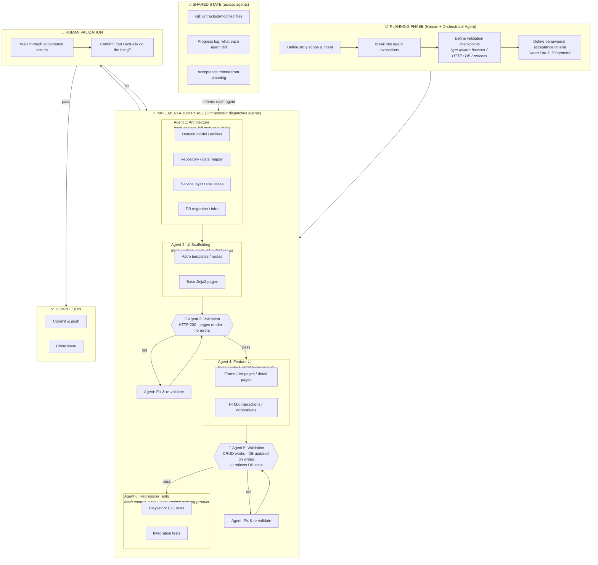

# Epic Workflow v2 — Behavioural Validation

## Flow Diagram

## Agent Invocation Model

Each box is a **separate agent invocation** (fresh context window).
The orchestrator (human or script) dispatches them sequentially.

| Agent | Context it receives | What it produces |
|-------|-------------------|-----------------|
| **A1: Architecture** | Story intent, domain spec, existing patterns | Models, repos, services, migrations — committed to git |
| **A2: UI Scaffolding** | Story intent, git diff from A1 | Astro templates, Jinja2 pages, routes — committed to git |
| **A3: Validation** | Acceptance criteria (scaffolding subset) | Pass/fail + specific failures if any |
| **A4: Feature UI** | Story intent, git diff from A1+A2, MCP browser tools | Forms, HTMX, interactivity — committed to git |
| **A5: Validation** | Acceptance criteria (CRUD/behaviour subset) | Pass/fail + specific failures if any |
| **A6: Regression Tests** | Working product (git), acceptance criteria | Playwright + integration tests — committed to git |

**Each agent commits before exiting.** Next agent sees progress via git, not via shared context.

## Key Principles

### 1. Each agent does real work uninterrupted
An agent gets its task, builds the thing, commits. No mid-task validation loops.
The agent uses Task() internally for subtasks, but the agent itself IS the unit of work.

### 2. Validation is a separate agent, not a phase within implementation
Validation agents have different tools (browser, DB access) and different prompts
(verify behaviour, don't build). Clean separation of concerns.

### 3. Tests are regression nets, not the gate
Written AFTER the product works, by an agent that can see the working product.
The gate is behavioural validation, not test passage.

### 4. Lint/format is free — never spend agent tokens on it
Git pre-commit hooks run ruff/format automatically on commit.
Agents never invoke lint checking, ruff, or mypy.

### 5. Fresh context per agent, shared state via git + progress log
Each agent starts clean — no context rot from previous agents' exploration.
Progress tracked via git (modified/untracked files) + a progress log file.

### 6. Planning invests in intent, implementation invests in building
Planning phase defines WHAT must be true and HOW to check it.
Implementation phase builds. Validation phase checks.
No agent does all three.

## Validation Types (matched to task)

| Task type | Validation method | What it checks |
|-----------|------------------|----------------|
| UI page | HTTP GET + DOM assertions | 200, expected elements present |
| CRUD feature | Browser interaction + DB query | Create/read/update/delete, DB reflects changes |
| API endpoint | HTTP request + response body | Correct status, correct data shape |
| Infrastructure | Process/connectivity check | Service starts, connects, functions |
| Style/design | Screenshot | Visual appearance matches intent |
| Worker/pipeline | DB state after run | Data landed where expected |

## Token Efficiency

- **Batch tool calls** — parallel reads, parallel searches, parallel commands within agents
- **No lint/format tokens** — git hooks handle it (free)
- **No vanity tests** — tests written against working product, not as implementation drivers
- **No exploratory overhead** — agents get full context from planning, don't re-explore codebase
- **Strategic validation** — 2 checkpoints per story, not per-task
- **Fresh context** — prevents context rot, re-reading, summarisation loops
- **Commit between agents** — git diff is the handoff, not conversation history
