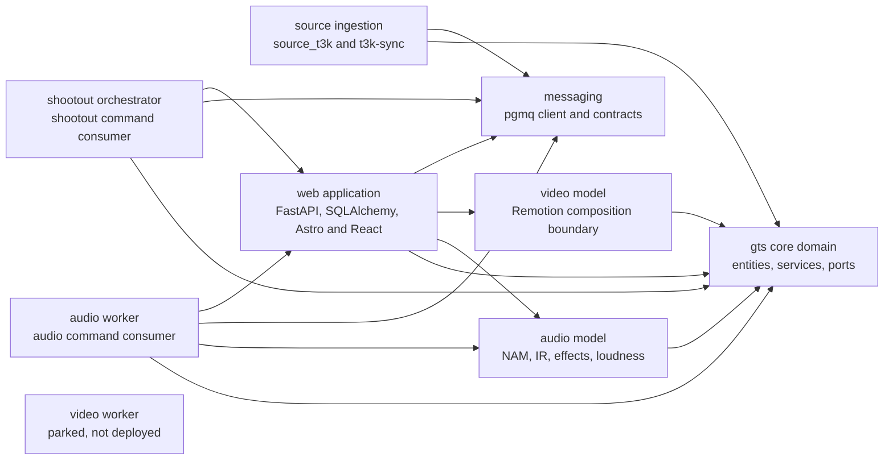

# Guitar Tone Shootout

[](https://github.com/krazyuniks/guitar-tone-shootout/actions/workflows/ci.yml)

Guitar Tone Shootout is an A/B comparison product for guitar amplifier tones. A user
builds several signal chains, supplies one clean direct-input (DI) recording, and
processes that recording through every chain. The resulting audio is normalised to the
same loudness so differences between amplifier captures, cabinet impulse responses and
effects can be compared without a volume bias.

The implementation separates the product into domain and application boundaries. It
uses a framework-free Python domain, ports with SQLAlchemy adapters,
PostgreSQL-backed transactional messaging, asynchronous audio workers, and separate
Astro and React front ends.

Development is active. Signal-chain modelling, shootout creation, Tone3000 ingestion,
job dispatch, Neural Amp Modeler inference and worker-side audio processing are
implemented. The user-triggered end-to-end processing path, manifest-gated media
delivery and shared browser comparison player remain open in
[issues 157 to 160](https://github.com/krazyuniks/guitar-tone-shootout/issues?q=is%3Aissue%20is%3Aopen%20157%20OR%20158%20OR%20159%20OR%20160).
Video composition is parked by
[ADR-0007](docs/adr/0007-video-composition-deferral.md), and no video worker is
currently deployed.

To run it, start with [Quickstart](#quickstart). To inspect it without running the
stack, follow the [reviewer path](#reviewer-path).

## Product model

A signal chain describes the order in which one direct-input track passes through
gear and processors. The stages appear below.

```text
DI track -> pre-effects -> amplifier -> loop effects -> cabinet impulse response (IR) -> post-effects
```

The domain validates rules such as one amplifier per chain, a required cabinet impulse
response for an amplifier head, and no separate cabinet impulse response for a full-rig
capture. A shootout applies the same input track to multiple valid chains. Audio
processing uses third-party Neural Amp Modeler (NAM) model inference through the
upstream `neural-amp-modeler` library. This repository does not train or provide the
Neural Amp Modeler model.

## Architecture

The repository uses domain-driven design to separate the core comparison model, source
ingestion, web application, processing workers and shared infrastructure. Solid arrows
below are current code dependencies. The detached video worker records the parked
runtime boundary; it is not present in the Docker service topology.



The `gts` and `messaging` packages have no dependencies on other project packages.
The audio and video libraries can depend on `gts`, but not on each other, sources or
applications. Source adapters conform to contracts owned by `gts`. The worker
applications currently use web application persistence adapters while their
composition roots are separated further. Import-linter contracts in
[pyproject.toml](pyproject.toml) check these dependency directions.

### Job and message flow

pgmq runs inside the same PostgreSQL database as application state. Producers send to
the queue through the same SQLAlchemy session and commit as the job or domain update.
This provides the transactional outbox guarantee without a separate relay table. The
state change and message either commit together or roll back together.

```mermaid
flowchart LR
    API["FastAPI use case"]
    TX1["one PostgreSQL transaction<br/>job state and pgmq send"]
    SQ["shootout_commands"]
    ORCH["shootout orchestrator"]
    TX2["one PostgreSQL transaction<br/>child jobs and audio commands"]
    AQ["audio_commands"]
    WORKER["audio worker"]
    DSP["NAM and IR processing<br/>European Broadcasting Union (EBU) R128 normalisation"]
    TX3["one PostgreSQL transaction<br/>audio segment and job transition"]
    FINAL["shootout finalisation<br/>versioned manifest"]

    API --> TX1 --> SQ --> ORCH --> TX2 --> AQ --> WORKER --> DSP --> TX3 --> FINAL
```



Messages use envelopes, visibility leases, bounded retry handling and a shared
`dead_letter` queue. The implemented processing path is covered by unit and integration
tests; completing its user-facing flow is tracked in
[issue 157](https://github.com/krazyuniks/guitar-tone-shootout/issues/157).

## Architecture and engineering choices

- Domain-driven design: `model/gts` owns the comparison language, aggregates, value
  objects, validation services and boundary contracts. Tone3000 ingestion remains a
  separate bounded context and conforms to core-owned synchronisation records.

- Onion architecture and dependency inversion: domain ports are Python protocols.
  FastAPI routes, SQLAlchemy repositories, source clients and queue consumers sit
  outside the domain and depend inward.

- Enforced dependency direction: import-linter checks package isolation and prevents
  framework imports in the domain and port packages during local checks and continuous
  integration (CI).

- One PostgreSQL instance: core, source and messaging data share `gts_core`. Bounded
  contexts own their tables through separate model bases and `core_*`, `t3k_*` and
  pgmq naming.

- Transactional publication: job state changes and pgmq queue writes share one database
  transaction. Consumers are designed for at-least-once delivery, idempotent handling,
  visibility leases and dead-letter handling.

- Python workers: `audio-worker` executes signal chains and writes level-normalised
  audio segments. `shootout-orchestrator` fans out and reconciles shootout jobs. The
  Remotion video composition library remains in the repository, but ADR-0007 parks the
  video worker and removes video from the version-one completion gate.

- Two front-end surfaces: Astro builds the public and search-indexed surface, with
  Jinja2 server rendering and small HTMX, Alpine and React interactions. The
  authenticated workspace under `/app/*` is a Vite and React application using
  TanStack Router. The public site is not described as a React single-page
  application because it is not one.

- Real-service testing: pytest integration tests use PostgreSQL and pgmq. Browser tests
  use Playwright against the running stack and verify visible output plus database
  state. The quality gate bans `unittest.mock`. GitHub Actions builds both front ends,
  runs Python tests and checks import contracts.

## Verified stack

The current Python, Node and Docker manifests define this stack.

| Area | Technology |
|---|---|
| Backend | Python 3.14, FastAPI, Pydantic 2, SQLAlchemy 2, asyncpg |
| Data and messaging | PostgreSQL 18, pgmq 1.10, Alembic |
| Audio | PyTorch, neural-amp-modeler, Pedalboard, SoundFile, pyloudnorm |
| Public front end | Astro 5, Jinja2, HTMX, Alpine.js, React islands, Tailwind cascading style sheets (CSS) |
| Authenticated application | React 19, Vite 7, TanStack Router, openapi-typescript |
| Video composition library | Remotion 4, React, Pillow |
| Development | Docker Compose, uv workspaces, just |
| Verification | pytest, Playwright, Ruff, mypy, import-linter, GitHub Actions |

## Quickstart

Requirements are Docker with Compose v2, `uv`, `just`, Git and the GitHub command-line
interface (CLI).

Run this command for a first checkout.

```bash
./scripts/first-time-setup.sh
```

Run this command for the existing main checkout.

```bash
just up-d
```

The application entry point is `http://localhost:9000`. Run the following command to
inspect the supported command surface before running project tasks.

```bash
just --list
```

Feature work uses the following host worktree engine command to create an isolated
checkout and stack.

```bash
worktree up gts <branch>
```

See [DEVELOPMENT.md](DEVELOPMENT.md) for environment details, commands and testing.

## Reviewer path

| Concern | Representative code |
|---|---|
| Domain aggregate and invariants | [`SignalChain`](model/gts/src/gts/domain/entities/signal_chain.py) |
| Port boundary | [Repository protocols](model/gts/src/gts/ports/repositories.py) |
| SQLAlchemy adapter | [`SQLAlchemySignalChainRepository`](apps/webapp/src/webapp/adapters/persistence/repositories/signal_chain_repository.py) |
| Transactional queue dispatch | [`job_dispatch.py`](apps/webapp/src/webapp/services/job_dispatch.py) |
| Message transport | [`PgmqClient`](infra/messaging/src/messaging/pgmq_client.py) |
| React application | [Build route](frontend/app/src/routes/build.tsx) |
| Audio worker | [Audio command consumer](apps/audio_worker/src/audio_worker/consumer.py) |
| Video composition | [`ShootoutVideo`](model/video/src/video/remotion/compositions/ShootoutVideo.tsx) |
| Dependency contracts | [Import-linter configuration](pyproject.toml) |
| Real-service test | [Transactional dispatch integration test](tests/integration/webapp/test_job_dispatch_outbox.py) |
| Continuous integration | [GitHub Actions workflow](.github/workflows/ci.yml) |

## Documentation and contribution

- [Development guide](DEVELOPMENT.md)
- [Architecture decisions](docs/adr/)
- [Shootout artefact contract](docs/design/shootout-artefact-contract.md)
- [Project agent instructions](AGENTS.md)
- [GitHub wiki](https://github.com/krazyuniks/guitar-tone-shootout/wiki)

## Related public work

- [Chorus](https://github.com/krazyuniks/chorus) is a separate reference
  implementation of multi-agent workflows using ports, adapters and schema-validated
  boundaries. It has no runtime integration with Guitar Tone Shootout.

- [Woof](https://github.com/krazyuniks/woof) is a separate Python workflow engine that
  runs software delivery workflows and their checks. This repository carries thin Woof
  consumer configuration, but the Guitar Tone Shootout product runtime does not depend
  on it.
